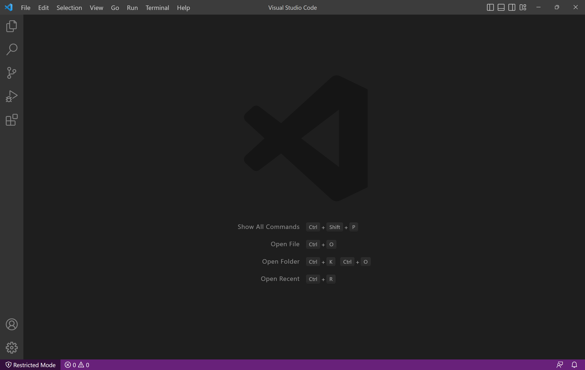
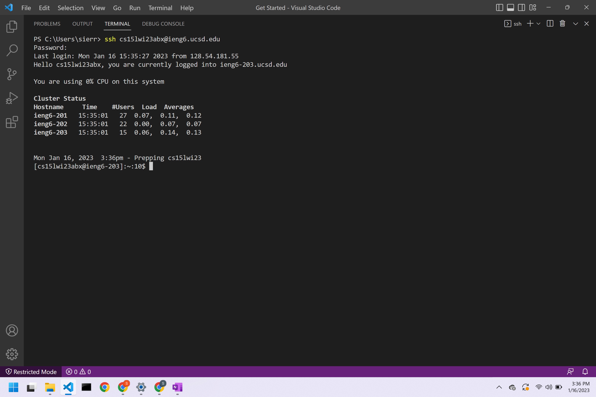

## Lab Report 1
### Step 1: Installing VScode
To install Visual Studio Code, a user should go to the Visual Studio Code website using the link, [https://code.visualstudio.com](https://code.visualstudio.com/). Once on the website, a user should download the version that corresponds to their operating system, macOS or Windows, and follow the prompted installation steps. I did not have to download Visual Studio Code during Lab 1 as my prior enrolment in CSE8B had required me to download it at the beginning of the fall quarter. 

### Step 2: Remotely Connecting

### Step 3: Trying Some Commands

