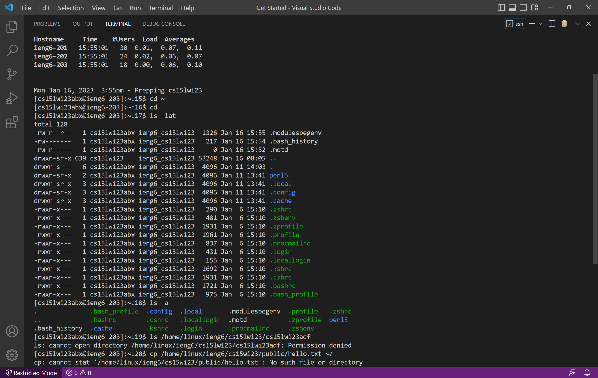

## Lab Report 1
### Step 1: Installing VScode
To install Visual Studio Code, a user should go to the Visual Studio Code website, using the link [https://code.visualstudio.com](https://code.visualstudio.com/). Once on the website, a user should download the version that corresponds to their operating system, macOS or Windows, and follow the prompted installation steps. I did not have to download Visual Studio Code during Lab 1 as my prior enrolment in CSE8B had required me to download it at the beginning of the fall quarter. 

### Step 2: Remotely Connecting
To remotely connect, a user must first install git, using the link [https://gitforwindows.org](https://gitforwindows.org/). Once git is installed the Git Bash terminal should be set to the default terminal. Then, the line of code, `ssh cs15lwi23___@ieng6.ucsd.edu` with the blank being filled by the user's unique letters in their account name, is used to access the remote server and the user is prompted to enter their password, note that it will appear as though nothing is being typed however it is not visually apparent but the typed input is being received. 

### Step 3: Trying Some Commands
The commands that I tried during my remote connection included `cd ~`, `cd`, `ls -lat`, `ls -a`, `ls /home/linux/ieng6/cs15lwi23/cs15lwi23abf`, and `cp /home/linux/ieng6/cs15lwi23/public/hello.txt ~/`. `cd` causes the directory to be changed and `cd ~` causes the directory to be changed to the home directory. `ls -lat` lists the items in the directory and `ls -a` shows the hidden items in the directory. `ls /home/linux/ieng6/cs15lwi23/cs15lwi23abf`, attempts to access the direcory of another user, however I received the message the I did not have permission to access it. 

